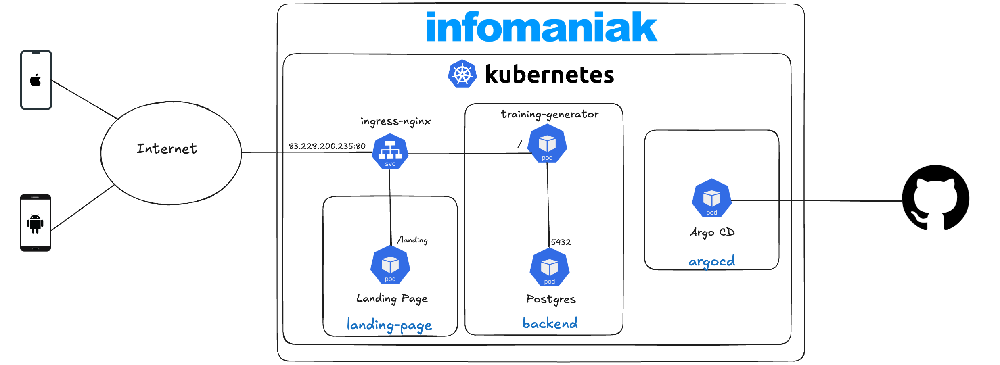

# Infrastructure

Dans ce répertoire, vous allez retrouver les différentes configurations du cluster Kubernetes hébergé chez Infomaniak.

Les composants exposés sont les suivants :
- http://83.228.200.235 : backend api
- http://83.228.200.235/api : backend api documentation
- http://83.228.200.235/landing : landing page

Ci-dessous le schéma de l'infrastructure.

